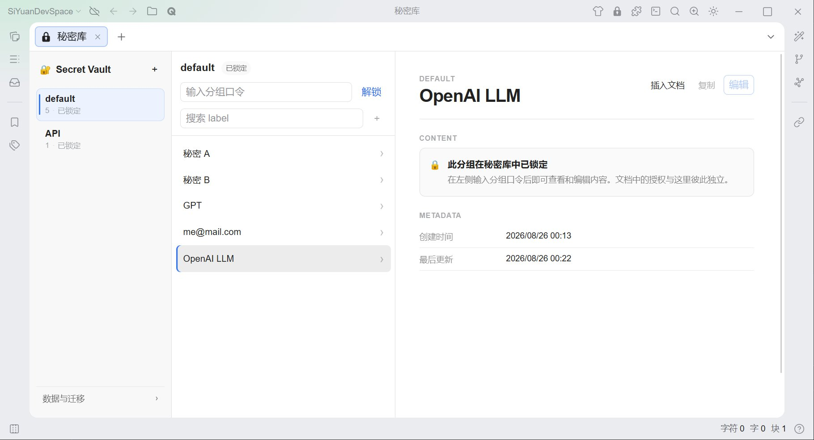
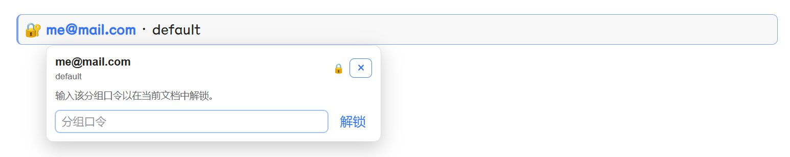

# Secret Vault

Secret Vault is a SiYuan plugin for storing encrypted secrets on your own device. Secrets live in the plugin's private data store; your documents only contain inert text references, so opening a document never runs plugin code or loads any secret. Clicking a reference explicitly opens a popover to unlock, view, edit, or copy the secret.

## What it can do

- Secrets are organized into groups, and each group has its own password. Content is encrypted with PBKDF2 + AES-256-GCM; keys are derived in memory and never persisted.
- A reference in a document is an ordinary paragraph with a plugin deep link and non-sensitive snapshots (label, group name, timestamps).
- Clicking a reference opens a single non-modal popover anchored to the link, where you can unlock the group, view multi-line content, edit label/content, copy, and lock.
- A Vault workspace manages groups and secrets, and offers an explicit migration center for old references.

## How to use it

1. Install the plugin from the marketplace, then open **Secret Vault** from the top bar.
2. Create a group and set its password. All secrets in the group are encrypted with that password.
3. Add secrets to the group; multi-line content is supported.
4. In a document, type `/secret` and choose **新建秘密并插入** to create a secret and insert its reference, or **插入已有秘密** to insert an existing one.
5. Click the 🔐 link in the paragraph, enter the group password in the popover, then view, edit, or copy the content. Click the lock button or wait for the idle timeout when you are done.

Plaintext exists only in memory while a group is unlocked. Authorization is scoped to the current editor context and is revoked on idle timeout (15 minutes), manual lock, context destruction, vault reload after sync, password change, or plugin unload.

## Screenshots

<!-- TODO: add screenshots under docs/screenshots/ -->

## License

MIT
